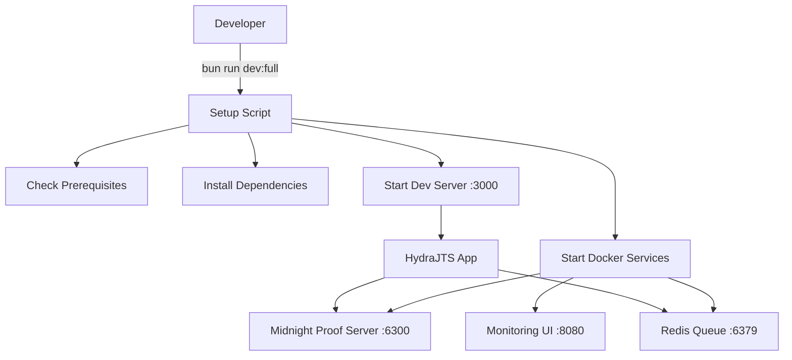

# 🚀 HydraJTS One-Button Developer Setup

## Quick Start (One Command!)

```bash
bun run dev:full
```

This single command will:
1. ✅ Check prerequisites (Bun, Docker)
2. ✅ Install all dependencies
3. ✅ Start Midnight proof server in Docker
4. ✅ Start Redis for distributed queue
5. ✅ Configure environment variables
6. ✅ Launch development server
7. ✅ Open browser at http://localhost:3000

## Manual Setup Options

### Start Everything
```bash
# Full setup with all services
bun run dev:full

# Or just Docker + dev server
bun run dev:docker
```

### Docker Management
```bash
# Start Docker services
bun run docker:up

# Stop Docker services
bun run docker:down

# View Docker logs
bun run docker:logs
```

### Development Commands
```bash
# Start dev server only (requires Docker running)
bun run dev

# Run tests
bun test

# Watch tests
bun run test:watch

# Type checking
bun run typecheck

# Check proof server health
bun run proof:health
```

## Service URLs

| Service | URL | Description |
|---------|-----|-------------|
| **HydraJTS UI** | http://localhost:3000 | Main application |
| **Proof Server** | http://localhost:6300 | Midnight proof generation |
| **Proof Health** | http://localhost:6300/health | Health check endpoint |
| **Redis** | redis://localhost:6379 | Queue management |
| **Proof UI** | http://localhost:8080 | Optional monitoring UI |

## Environment Configuration

The setup script automatically creates `.env.local` with:

```env
MIDNIGHT_PROOF_SERVER_URL=http://localhost:6300
REDIS_URL=redis://localhost:6379
MAX_CONCURRENT_HEADS=4
ENABLE_HYDRA_HEADS=true
LOG_LEVEL=debug
```

## Architecture



## Troubleshooting

### Docker Issues

**Problem**: Docker daemon not running
```bash
# macOS
open -a Docker

# Linux
sudo systemctl start docker

# Windows
# Start Docker Desktop
```

**Problem**: Port already in use
```bash
# Find and kill process using port
lsof -i :6300
kill -9 <PID>

# Or change port in docker-compose.yml
```

### Proof Server Issues

**Problem**: Proof server not responding
```bash
# Check logs
docker-compose logs midnight-proof-server

# Restart service
docker-compose restart midnight-proof-server

# Health check
curl http://localhost:6300/health
```

### Development Server Issues

**Problem**: Module not found errors
```bash
# Clear cache and reinstall
rm -rf node_modules bun.lock
bun install
```

## Testing the Setup

### 1. Verify Services
```bash
# Check all services are running
docker-compose ps

# Test proof server
curl http://localhost:6300/health

# Test Redis
redis-cli ping
```

### 2. Test Proof Generation
```javascript
// In browser console at http://localhost:3000
const response = await fetch('http://localhost:6300/generate', {
  method: 'POST',
  headers: { 'Content-Type': 'application/json' },
  body: JSON.stringify({
    circuitId: 'test-circuit',
    inputs: { value: 42 }
  })
});
const proof = await response.json();
console.log('Generated proof:', proof);
```

### 3. Run HydraJTS Tests
```bash
bun test
```

## Production Deployment

For production, update environment variables:

```env
MIDNIGHT_PROOF_SERVER_URL=https://proof.midnight.network
REDIS_URL=redis://production-redis:6379
MAX_CONCURRENT_HEADS=8
ENABLE_HYDRA_HEADS=true
LOG_LEVEL=info
```

## Advanced Configuration

### Custom Proof Server Image

If you have a custom Midnight proof server:

```dockerfile
# Dockerfile.custom
FROM your-registry/midnight-proof-server:latest
# Add custom configuration
```

Update `docker-compose.yml`:
```yaml
midnight-proof-server:
  build:
    context: .
    dockerfile: Dockerfile.custom
```

### Scaling Workers

Increase concurrent proof capacity:

```yaml
# docker-compose.yml
midnight-proof-server:
  scale: 3  # Run 3 instances
  environment:
    - MAX_CONCURRENT_PROOFS=20
```

## Monitoring

### View Metrics
```bash
# Real-time logs
docker-compose logs -f

# Resource usage
docker stats

# Proof server metrics
curl http://localhost:6300/metrics
```

### Performance Dashboard

Access the monitoring UI at http://localhost:8080 for:
- Proof generation times
- Queue depth
- Success/failure rates
- Resource utilization

## Support

- **Issues**: [GitHub Issues](https://github.com/bytewizard42i/HydraJTS/issues)
- **Author**: John Santi (bytewizard42i)
- **Email**: hariamoor@proton.me

---

**Remember**: The one-button setup (`bun run dev:full`) handles everything automatically! 🎉
