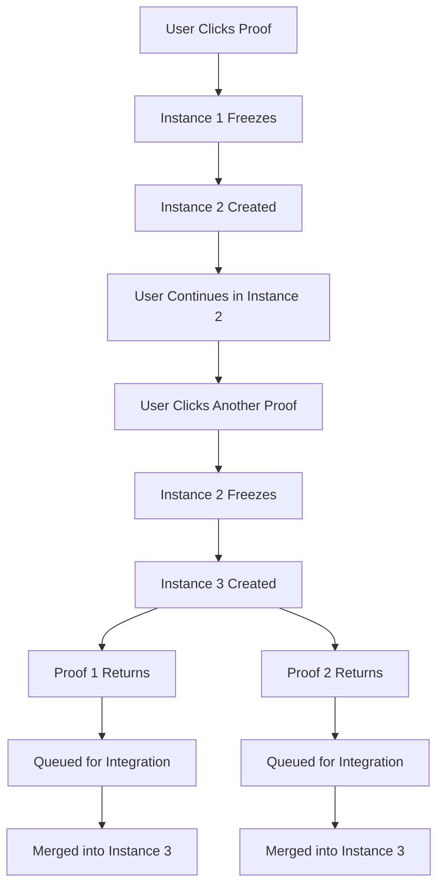

# HydraJTS Troubleshooting Guide

## Common Issues and Solutions

### 🔴 Issue: "Proof server work, gui runs, but the gui dont seem to get anything going after that"

**This was the OLD behavior** - The connect button logic has been completely replaced with the new instance-based protocol.

**Solution**: The new protocol doesn't use a connect button. Instead:
1. Make sure Docker services are running: `docker-compose ps`
2. Access the UI at `http://localhost:3000`
3. Click "Call Proof" to test the protocol
4. You should see instances being created automatically

### 🔴 Issue: Understanding "What are Instances?"

**Instances are JavaScript execution contexts**, NOT proof servers or Docker containers.

Think of it like this:
```
Regular JavaScript:
[Your Code] → [Call Proof] → [⏸️ WAIT for proof] → [Continue]
                                  ↑ 
                             Program BLOCKED

HydraJTS Protocol:
[Instance 1] → [Call Proof] → [🧊 FROZEN - waiting]
                    ↓
            [Instance 2 SPAWNED] → [Continue working] → [Call Another Proof] → [🧊 FROZEN]
                                            ↓
                                    [Instance 3 SPAWNED] → [Keep working]
```

**Each instance is**:
- A JavaScript execution context
- Like a browser tab overlay
- Shares state but runs independently
- Can be frozen while others run

### 🔴 Issue: IPs and Connection Problems

**For local development**:
```bash
# Everything runs on localhost
PROOF_SERVER: http://localhost:6300
REDIS: redis://localhost:6379
APP: http://localhost:3000
```

**For remote access** (when Roberto SSHs in):
```bash
# Option 1: SSH Port Forwarding
ssh -L 3000:localhost:3000 -L 6300:localhost:6300 user@server

# Then access locally:
# http://localhost:3000

# Option 2: Update the code to use server IP
# Change localhost to your server's IP in:
# - src/components/ProofServerStatus.tsx
# - src/components/HydraProtocol.tsx
```

### 🔴 Issue: Docker Connection Errors

```bash
# Error: Cannot connect to Docker daemon
docker context use default
sudo systemctl start docker

# Error: Permission denied
sudo usermod -aG docker $USER
# Then logout and login again
```

### 🔴 Issue: Understanding the GUI Functionality

**Old GUI (what Roberto was looking at)**:
- Had a connect button
- Required manual connection setup
- Blocked on proof calls

**New GUI (HydraProtocol)**:
- **No connect button needed**
- **Automatic instance management**
- **Visual instance stack display**
- **Real-time status dashboard**

**What each part does**:
1. **Instance Dashboard** - Shows how many JS instances are running
2. **Instance Stack Visualization** - Visual representation of overlaid instances
3. **Call Proof Button** - Triggers instance creation and proof call
4. **Demo Protocol Button** - Automatically demonstrates the multi-instance behavior
5. **Proof Jobs List** - Shows all proofs being processed

### 🔴 Issue: Nothing Happens When Clicking Buttons

**Check these in order**:

1. **Browser Console** (F12):
```javascript
// Should see messages like:
[HydraJTS] Created new instance instance-1234567890
[HydraJTS] Proof proof-1234567890 returned. Queued for integration.
```

2. **Proof Server Status**:
```bash
curl http://localhost:6300/health
# Should return: {"status":"healthy","version":"mock-v4"}
```

3. **Check CORS/Network**:
```bash
# In browser console, test:
fetch('http://localhost:6300/health').then(r => r.json()).then(console.log)
```

### 🔴 Issue: Instances Not Creating

**Verify the import chain**:
```
index.tsx → imports HydraProtocol
HydraProtocol → imports instanceManager
instanceManager → exports hydraInstances
```

**Check if instanceManager is loaded**:
```javascript
// In browser console:
console.log(window.hydraInstances) // Should be undefined in production
// But you should see [HydraJTS] logs in console
```

### 🔴 Issue: Proofs Not Returning

**For mock server**:
- Proofs should return in 2-5 seconds
- Check Docker logs: `docker logs hydrajts-proof-server`

**For real Midnight testnet**:
- Proofs may take 30+ seconds
- Check network connectivity
- Verify API keys if required

### 🔴 Issue: "When calling for the second proof, its supposed to be a different proof server?"

**NO!** It's the SAME proof server, but DIFFERENT JavaScript instances.

```
Proof Server (Docker) - Can handle MANY concurrent requests
     ↑        ↑        ↑
     |        |        |
Instance1  Instance2  Instance3  (JavaScript contexts)
```

The proof server (Docker container) handles multiple proof requests just fine.
The innovation is the JavaScript side - creating multiple execution contexts.

### 🔴 Issue: Understanding Remote vs Local

**For Roberto testing remotely**:

1. **All services run on the server**:
```bash
# On the server
cd /home/js/utils_Midnight/utils_HydraJTS
docker-compose up -d
bun run dev
```

2. **Access from Roberto's machine**:
```bash
# Option A: SSH tunnel (recommended)
ssh -L 3000:localhost:3000 user@server
# Then open browser to http://localhost:3000

# Option B: Expose ports (less secure)
# Edit package.json, change dev script to:
"dev": "vinxi dev --host 0.0.0.0"
# Then access http://server-ip:3000
```

### 🔴 Issue: Changes Not Appearing

```bash
# Stop everything
docker-compose down
# Kill the dev server (Ctrl+C)

# Clean restart
docker-compose up -d
bun run dev

# Force refresh browser
Ctrl+Shift+R (or Cmd+Shift+R on Mac)
```

## Quick Diagnostic Commands

```bash
# 1. Check all services
docker-compose ps

# 2. Test proof server
curl http://localhost:6300/health

# 3. Check logs
docker-compose logs -f

# 4. Test a mock proof
curl -X POST http://localhost:6300/generate \
  -H "Content-Type: application/json" \
  -d '{"circuitId":"test","inputs":{"data":"test"}}'

# 5. Check ports
netstat -tulpn | grep -E '3000|6300|6379'
```

## Understanding the Protocol Flow



## Still Having Issues?

1. **Clear browser cache and localStorage**
2. **Check browser compatibility** (Use Chrome/Firefox/Edge latest)
3. **Verify Node version**: `node --version` (should be 20+)
4. **Check Bun version**: `bun --version` (should be latest)
5. **Look for error messages prefixed with `[HydraJTS]` in browser console**

Remember: The protocol is about **JavaScript instances**, not Docker containers or proof servers!
